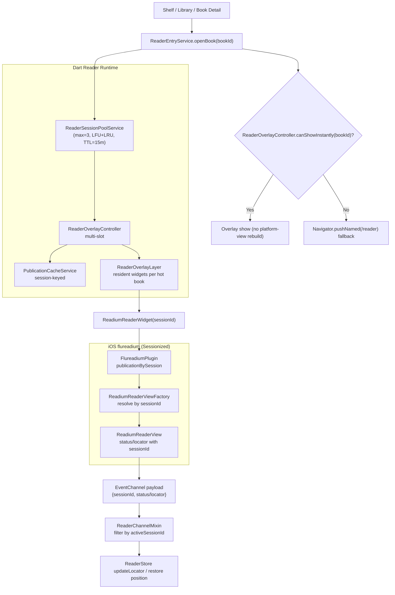

# 模块：reader

## 模块目的

提供沉浸式书籍阅读体验，使用 Readium SDK (flureadium) 进行 EPUB 渲染与分页，支持点击显隐上下控制层、章节目录/笔记/进度/亮度/字体五入口面板，以及按书保存阅读偏好。

## 边界

### In

- 打开书籍并恢复上次阅读位置（通过 Readium Locator JSON）
- 使用 Readium SDK 原生分页与渲染
- 点击正文显隐顶部/底部控制层
- 顶部右侧三点打开图书信息型 bottom sheet
- 底部五入口打开章节/笔记/进度/亮度/字体面板
- 阅读偏好（字体、边距、行距、颜色、亮度）按书持久化
- 高亮创建与回显（通过 Readium Decoration API）

### Out

- 听书/AI/翻译真实能力
- 三点面板中功能按钮的完整业务（当前为占位）
- 真实阅读时长统计（当前为 UI 占位值）
- TXT/PDF 等非 EPUB 格式支持

## 核心流程

1. 根据 `bookId` 打开书籍，**并行**加载图书元数据、阅读进度（Locator JSON）、该书偏好设置（`Future.wait`）。
2. 通过 `PublicationCacheService.getOrOpen(epubFilePath)` 打开 EPUB 文件。若同一本书被再次打开，直接复用缓存的 Publication，跳过原生 EPUB 解析（节省 ~800ms）。
3. Overlay 预热链路会优先把 `initialLocator` 传给 `ReadiumReaderWidget`，让原生 reader 首次渲染尽量直接落在历史位置，减少“先打开再跳转”卡顿。
4. 进入阅读后仍会执行保存位置恢复（`flureadium.goToLocator(locator)`）作为兜底，兼容历史数据或初始定位失败场景。
5. 应用用户偏好设置到 Readium（`setEPUBPreferences`）。
6. 监听 Readium 位置变化（`onTextLocatorChanged`），更新进度并定时持久化。
7. 点击正文切换上下控制层显隐；顶部三点与底部五入口面板按既定交互显示。
8. 亮度/字体设置立即作用于 Readium 并写入 `reader_preferences`；离页时 flush 进度。
9. 离开 ReaderPage 时**不关闭 Publication**（保留缓存）。App 进入后台或终止时由 `ImmersedApp` 的生命周期监听器调用 `PublicationCacheService.evict()` 释放资源。

### 恢复时序（防竞态）

- `ReaderChannelMixin` 订阅顺序固定为：先订阅 `status` → 执行 `restoreSavedPosition()` → 再订阅 `locator`。
- 目的：避免首个 locator 事件先写回 store，覆盖旧进度后再恢复，导致“看起来没有跳回上次位置”。
- 多次快速订阅时使用订阅代次（epoch）保护；旧订阅在恢复完成后不会继续挂载 locator 监听。
- Overlay 可见切换时，必须先完成 `ReaderStore.openBook(bookId)`，再允许执行通道订阅和恢复。

## 近期变更纪要（2026-03）

本轮性能治理核心结论：慢点不在 Flutter spinner（几十毫秒），而在 Readium iOS 首次可见信号之前的 WebView/渲染链路。

关键演进如下：

1. **入口统一为 overlay-first**
   - `Book Detail` / `Shelf` / `Library` 的 reader 入口统一为：
   - 命中预热实例 -> `overlay.show`
   - 未命中 -> route fallback（`RouteNames.reader`）
2. **从单实例缓存升级到多实例热池（iOS First）**
   - 由“单 publication + 单 overlay slot”升级为“最多 3 本热书池”。
   - 每本热书绑定一个 `sessionId`（当前使用 `bookId`），支持并存。
3. **修复“看似预热但仍不秒开”的根因**
   - 根因：曾出现“隐藏预热 widget”和“显示时 widget”是两棵实例，点击时仍重建 platform view。
   - 修复：改为**每本书单一常驻 reader widget**，显示/隐藏仅切换位置与交互态，不重建。
4. **会话事件隔离**
   - iOS status/locator 事件携带 `sessionId`，Dart 侧按 active session 过滤，避免多实例串流。
   - iOS 多实例 reader 共享同一组 EventChannel handler（`text-locator` / `reader-status` / `error`），避免多个 platform view 互相覆盖 stream handler 导致回调丢失。
5. **回收策略落地**
   - 池容量 `maxSize=3`
   - 淘汰策略 `LFU + LRU`
   - `TTL=15min` 自动回收
   - 触发：容量溢出、周期 GC、App lifecycle（paused/detached）
6. **iOS 渲染侧收敛**
   - 预加载窗口收敛为 `preloadPrevious=0`、`preloadNext=2`
   - `setupUserScripts` 改为聚合统计，降低日志噪音，便于定位关键链路。

## 当前架构（Overlay 热池 + 会话化 Readium）



### 秒开成立条件（定义）

- 目标书已经在热池中，且对应常驻 reader widget 已 `content_ready`。
- 点击时命中 `entry.overlay_hit`。
- 点击后不应再看到该书新一轮 `publication.open_native.start`（否则说明发生重开/重建）。

### Readium 渲染架构

```
导入层                          Readium SDK                      ReaderPage
EPUB → 拷贝到本地目录            原生 EPUB 解析与渲染              ReadiumReaderWidget
     → 存储 epubFilePath        ↓ 分页/滚动                      + 控制层 UI
                                ↓ Locator 回调                   + 高亮 Decoration
```

1. **导入层**：`BookImportService` 提取 EPUB 元数据（标题、作者、封面），EPUB 文件整体拷贝到本地 `booksDirectory`，存储 `epubFilePath`。
2. **Readium 层**：flureadium 包装 Readium SDK（iOS/Android 原生），处理 EPUB 解析、分页、渲染、位置追踪。
3. **UI 层**：`ReaderPage` 承载 `ReadiumReaderWidget` 并管理控制层、偏好面板等 Flutter UI。

### 位置追踪

- 使用 Readium Locator（EPUB CFI 格式）代替章节 + 字符偏移。
- Locator 包含 `href`（spine 位置）、`locations`（进度百分比）等字段。
- 通过 `onTextLocatorEvents` 实时获取当前位置事件，先用 locator 的 `href` 在 publication `readingOrder` 中定位章节索引，再结合章节内进度（`progression` 或 `page/totalPages`）换算为全书进度，更新 `ReaderState.bookPercent`。
- 若无法定位到章节索引，则仅在有 `pageIndex/totalPages` 时按页码比值兜底；若仍缺失则本次不更新百分比。不使用 `locations.totalProgression` 作为进度来源。

### 高亮机制

- **创建**：从 Readium 选区获取 Locator 和选中文本，存储到 `highlights` 表。
- **回显**：通过 `flureadium.applyDecorations()` API 将高亮应用到 Readium 渲染层。
- 高亮位置基于 Readium Locator（CFI），跨设备/版本稳定。

## 关键状态与数据

- `ReaderState.book` — 当前图书实体
- `ReaderState.locatorJson` — 当前 Readium Locator JSON
- `ReaderState.bookPercent` — 阅读进度百分比
- `ReaderState.preferences` — 阅读偏好
- `ReaderState.isLoading / isReaderReady`
- `ReadingProgressEntity(bookId, locatorJson, percent, updatedAt)`
- `ReaderPreferencesEntity(bookId, fontSize, pagePaddingLevel, lineHeightLevel, letterSpacing, textColor, backgroundColor, brightness, fontFamily, firstLineIndent, pageTurnMode)`
- `reader_preferences` 表（`book_id` 主键）
- `reading_progress` 表（`book_id` 主键，存储 `locator_json`）
- `PublicationCacheService` — 多 session Publication 缓存（iOS first）。按 `sessionId(bookId)` 维护最多 3 本热书可复用 Publication，并支持按 session 回收。
- `ReaderSessionPoolService` — 热书会话池（`maxSize=3`），维护 `openCount`、`lastOpenedAt`、`lastUsedAt`，淘汰策略为 `LFU + LRU`，并带 `TTL=15min` 自动回收。
- **原生 Manifest 磁盘缓存** — 首次打开 EPUB 后，原生层（ReadiumReader / FlureadiumPlugin）将 manifest JSON 写入 `{epubPath}.manifest.json`。后续打开同一 EPUB 时直接从缓存重建 Publication（跳过 OPF 解析）。缓存对 Dart 层完全透明。
- **EPUB 预解压** — 导入时将 EPUB ZIP 解压到 `books/{bookId}/` 目录。原生层优先用 `DirectoryContainer` 从解压目录读取资源（~5ms），跳过 ZIP 操作（~130ms）。解压目录不存在时 fallback 到 ZIP 路径。删除书籍时同步清理解压目录和 manifest 缓存。
- **Reader 预加载（Overlay 方案）** — 入口统一 overlay-first + route fallback。当前为多槽热池（最多 3 本）+ 单可见 overlay：命中热池时优先 overlay，未命中回退 `RouteNames.reader`。不做“点击后等待预加载完成”的阻塞。
- **WKWebView Pre-warm** — iOS 插件注册时预创建一个空 WKWebView，提前启动 WebContent 进程。后续所有 WKWebView 创建都会更快。

## 交互与异常

- 默认显示正文，控制层默认隐藏。
- 阅读正文渲染区域默认避开系统状态栏与底部手势区（内容不贴顶/贴底）。
- 安全区留白使用与当前 Readium 页面一致的背景色填充，避免透出下层页面内容。
- **Overlay 入口**：单击正文后显示顶部/底部控制层，再次单击隐藏；切换到其他可见书籍或关闭 overlay 时重置为隐藏。
- Overlay 控制层为白色主题，顶部/底部栏会覆盖状态栏与系统手势区域，并从屏幕外滑入。
- Overlay 顶部 header：左侧返回按钮（退出阅读），右侧设置按钮（当前为 UI 占位）。
- Overlay 底部配置区：`Contents / Notes / Progress / Brightness / Font` 五入口（当前为仅图标工具栏 UI 占位）。
- 章节面板支持 Readium TOC 导航与章节跳转。
- 亮度通过阅读层遮罩实现，不调用系统亮度 API。
- 图书不存在或 EPUB 文件缺失时显示错误态。
- 偏好或进度保存失败时不阻断阅读流程。

## 性能埋点与排查

- 统一使用 `[PERF][Reader]` 前缀日志（`ReaderPerf`）记录关键阶段耗时。
- 关键埋点阶段：
  - `entry.open` / `entry.overlay_hit` / `entry.route_fallback` / `entry.route_push`
  - `pool.hit` / `pool.miss` / `pool.evict` / `pool.gc.run` / `session.open_count_increment`
  - `overlay.preload` / `overlay.show` / `overlay.reader_widget_ready`
  - `overlay.preload.publication_ready` / `overlay.content_ready`
  - `publication.get_or_open` / `publication.cache_hit` / `publication.open_native`
  - `store.open_book` / `store.open_book.query`
  - `page.init_reader` / `page.init_reader.get_publication` / `page.reader_widget_ready`
  - `page.first_frame_after_publication`
  - `page.spinner.show` / `page.spinner.stage_change` / `page.spinner.hide` / `page.spinner.total_visible` / `page.first_paint_after_spinner_hide`
  - `channel.first_status_event` / `channel.first_locator_event` / `channel.restore`（恢复 locator 跳转）
  - `entry.route_fallback_to_page_init`（路由回退后到页面真正初始化的延迟）
  - iOS 原生链路（`[PERF][Reader][iOS]`）：
    - `native.open_publication.*`（cache hit/miss/full parse）
    - `native.reader_view.init.start/navigator_created/init.done`
    - `native.reader_view.first_location_changed/status_ready_sent`
    - `native.reader_view.navigator_created_to_first_location`
      （EPUBNavigator 创建后到首个可见位置信号）
    - `native.reader_view.go_to_locator.start/await_go_end/go_to_locator_to_location_changed`
      （`goToLocator` 调用链路耗时）
    - `native.reader_view.setup_user_scripts.summary_first_location/summary_deinit`
      （字段：`totalSetupCalls` / `uniqueControllers` / `scriptsInjectedTotal`）
- 排查顺序（先看哪段最慢）：
  1. 入口是否命中 `entry.overlay_hit`；若否，先看为何预加载没命中。
  2. 若命中 overlay 但慢：看 `overlay.preload` 与 `overlay.reader_widget_ready`。
  3. 若走路由慢：看 `page.init_reader` 中 `store.open_book.query`、`publication.open_native`、`channel.restore` 三段。
  4. 若 `publication.cache_hit` 频率低：检查是否频繁淘汰 session 或命中 TTL 回收（当前为 3 本热池）。
  5. 若 `setupUserScripts` 异常频繁：优先观察 `summary_*` 聚合字段，并结合 iOS 预加载窗口（当前 `preloadPrevious=0`、`preloadNext=2`）评估 WKWebView controller 创建压力。
  6. 若首屏仍慢：对比 `navigator_created_to_first_location` 与 `go_to_locator_to_location_changed`，判断瓶颈在初始渲染还是定位跳转链路。
  7. iOS Web 层细分：查看 `native.reader_view.web_perf_markers`（`domContentLoadedMs` / `firstPaintMs`），判断慢点在 DOM 构建还是首帧绘制。

## 验收标准

- 阅读页使用 Readium 原生渲染，支持点击显隐控制层。
- EPUB 富文本（粗体、斜体、标题、列表、图片等）正确渲染。
- Overlay 顶部提供返回 + 设置按钮（设置为占位，不含真实业务）。
- 底部存在五个入口并能弹出对应面板。
- Overlay 入口支持点击显隐 header + 底部五入口，占位按钮可点击且不阻断阅读主流程。
- 章节目录支持跳转。
- 亮度/字体设置实时生效且重启后可恢复。
- 阅读进度（Locator）重启后正确恢复。
- 高亮创建与回显功能正常。
- `flutter analyze` 通过。

## 非目标

- 不实现三点面板内"下载完成/自动翻页/书友想法"等真实业务链路。
- 不实现 AI/翻译/听书能力。
- 不实现真实阅读时长累计统计。
- 不支持 TXT/PDF 等非 EPUB 格式（本次重构范围）。
- 不兼容旧版阅读进度/高亮数据（破坏式重构）。
